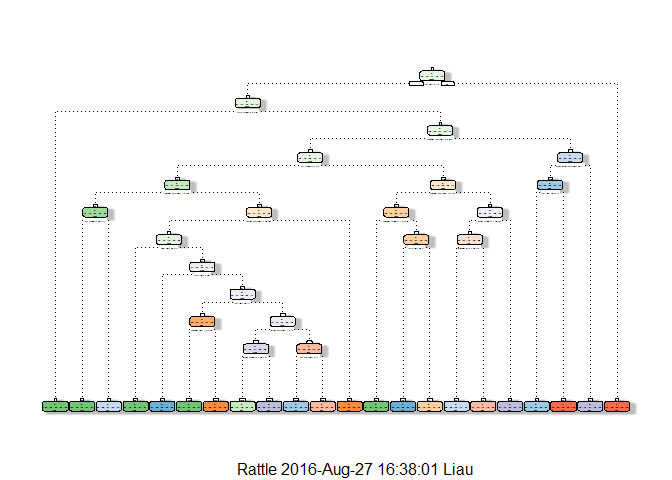

# PML Final Project
Swee Yean  
August 27, 2016  
#Background and Introduction
Using devices such as Jawbone Up, Nike FuelBand, and Fitbit it is now possible to collect a large amount of data about personal activity relatively inexpensively. These type of devices are part of the quantified self movement - a group of enthusiasts who take measurements about themselves regularly to improve their health, to find patterns in their behavior, or because they are tech geeks. One thing that people regularly do is quantify how much of a particular activity they do, but they rarely quantify how well they do it. In this project, your goal will be to use data from accelerometers on the belt, forearm, arm, and dumbell of 6 participants. They were asked to perform barbell lifts correctly and incorrectly in 5 different ways. More information is available from the website here: http://groupware.les.inf.puc-rio.br/har (see the section on the Weight Lifting Exercise Dataset).

Data
-----------
The training data for this project are available here:
https://d396qusza40orc.cloudfront.net/predmachlearn/pml-training.csv

The test data are available here:
https://d396qusza40orc.cloudfront.net/predmachlearn/pml-testing.csv

The data for this project come from this source: http://groupware.les.inf.puc-rio.br/har. 

###Libraries

```r
library(Hmisc)
library(caret)
library(randomForest)
library(foreach)
library(doParallel)
library(rpart)
library(rpart.plot)
library(RColorBrewer)
library(rattle)
set.seed(12345)
```

###Getting the data
The training data set can be found on the following URL:

```r
trainUrl <- "http://d396qusza40orc.cloudfront.net/predmachlearn/pml-training.csv"
```
The testing data set can be found on the following URL:

```r
testUrl <- "http://d396qusza40orc.cloudfront.net/predmachlearn/pml-testing.csv"
```
###Cleaning Data
Firstly, all blank('""'), '#DIV/0' and 'NA' values are converted to 'NA'. Any Columns containing 'NA' are removed from both downloaded data sets.

```r
training.df <- read.csv(url(trainUrl), na.strings=c("NA","#DIV/0!",""))
testcases.df <- read.csv(url(testUrl), na.strings=c("NA","#DIV/0!",""))
training.df<-training.df[,colSums(is.na(training.df)) == 0]
testcases.df <-testcases.df[,colSums(is.na(testcases.df)) == 0]
```

The features user_name, raw_timestamp_part_1, raw_timestamp_part_2, cvtd_timestamp ,new_window, num_window, are not related to calculations and are removed form the downloaded data.

```r
training.df   <-training.df[,-c(1:7)]
testcases.df <-testcases.df[,-c(1:7)]
```
Partioning the training set into two
Partioning Training data set into two data sets, 60% for myTraining, 40% for myTesting:

```r
inTrain <- createDataPartition(y=training.df$classe, p=0.6, list=FALSE)
myTraining <- training.df[inTrain, ]; myTesting <- training.df[-inTrain, ]
dim(myTraining); dim(myTesting)
```

```
## [1] 11776    53
```

```
## [1] 7846   53
```

####Using ML algorithms for prediction: Decision Tree

```r
modFitA1 <- rpart(classe ~ ., data=myTesting, method="class")
```
Note: to view the decision tree with fancy run this command:

```r
fancyRpartPlot(modFitA1)
```

<!-- -->

Predicting:

```r
predictionsA1 <- predict(modFitA1, myTesting, type = "class")
```
(Moment of truth) Using confusion Matrix to test results:

```r
confusionMatrix(predictionsA1, myTesting$classe)
```

```
## Confusion Matrix and Statistics
## 
##           Reference
## Prediction    A    B    C    D    E
##          A 2026  220   83  143   37
##          B   71  987   94  117  124
##          C   57  131 1049  205  163
##          D   39  111  102  711   63
##          E   39   69   40  110 1055
## 
## Overall Statistics
##                                          
##                Accuracy : 0.7428         
##                  95% CI : (0.733, 0.7524)
##     No Information Rate : 0.2845         
##     P-Value [Acc > NIR] : < 2.2e-16      
##                                          
##                   Kappa : 0.6731         
##  Mcnemar's Test P-Value : < 2.2e-16      
## 
## Statistics by Class:
## 
##                      Class: A Class: B Class: C Class: D Class: E
## Sensitivity            0.9077   0.6502   0.7668  0.55288   0.7316
## Specificity            0.9140   0.9358   0.9142  0.95198   0.9597
## Pos Pred Value         0.8075   0.7085   0.6536  0.69298   0.8035
## Neg Pred Value         0.9614   0.9177   0.9489  0.91569   0.9408
## Prevalence             0.2845   0.1935   0.1744  0.16391   0.1838
## Detection Rate         0.2582   0.1258   0.1337  0.09062   0.1345
## Detection Prevalence   0.3198   0.1775   0.2046  0.13077   0.1673
## Balanced Accuracy      0.9108   0.7930   0.8405  0.75243   0.8457
```
###Using ML algorithms for prediction: Random Forests

```r
modFitB1 <- randomForest(classe ~. , data=myTesting)
```
Predicting in-sample error:

```r
predictionsB1 <- predict(modFitB1, myTesting, type = "class")
```
(Moment of truth) Using confusion Matrix to test results:

```r
confusionMatrix(predictionsB1, myTesting$classe)
```

```
## Confusion Matrix and Statistics
## 
##           Reference
## Prediction    A    B    C    D    E
##          A 2232    0    0    0    0
##          B    0 1518    0    0    0
##          C    0    0 1368    0    0
##          D    0    0    0 1286    0
##          E    0    0    0    0 1442
## 
## Overall Statistics
##                                      
##                Accuracy : 1          
##                  95% CI : (0.9995, 1)
##     No Information Rate : 0.2845     
##     P-Value [Acc > NIR] : < 2.2e-16  
##                                      
##                   Kappa : 1          
##  Mcnemar's Test P-Value : NA         
## 
## Statistics by Class:
## 
##                      Class: A Class: B Class: C Class: D Class: E
## Sensitivity            1.0000   1.0000   1.0000   1.0000   1.0000
## Specificity            1.0000   1.0000   1.0000   1.0000   1.0000
## Pos Pred Value         1.0000   1.0000   1.0000   1.0000   1.0000
## Neg Pred Value         1.0000   1.0000   1.0000   1.0000   1.0000
## Prevalence             0.2845   0.1935   0.1744   0.1639   0.1838
## Detection Rate         0.2845   0.1935   0.1744   0.1639   0.1838
## Detection Prevalence   0.2845   0.1935   0.1744   0.1639   0.1838
## Balanced Accuracy      1.0000   1.0000   1.0000   1.0000   1.0000
```
###Generating Files to submit as answers for the Assignment:
Finally, using the provided Test Set out-of-sample error.

For Random Forests we use the following formula, which yielded a much better prediction in in-sample:

```r
predictionsB2 <- predict(modFitB1, testcases.df, type = "class")
```
Function to generate files with predictions to submit for assignment

```r
pml_write_files = function(x){
  n = length(x)
  for(i in 1:n){
    filename = paste0("problem_id_",i,".txt")
    write.table(x[i],file=filename,quote=FALSE,row.names=FALSE,col.names=FALSE)
  }
}

pml_write_files(predictionsB2)
```

